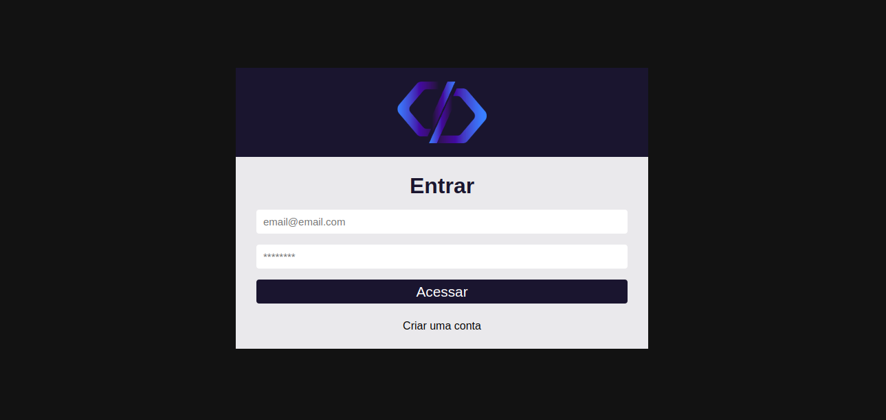
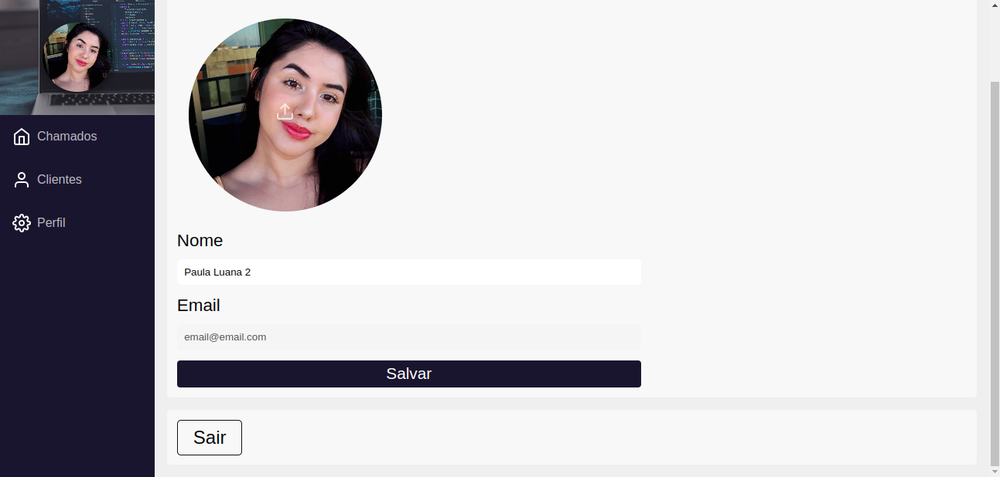
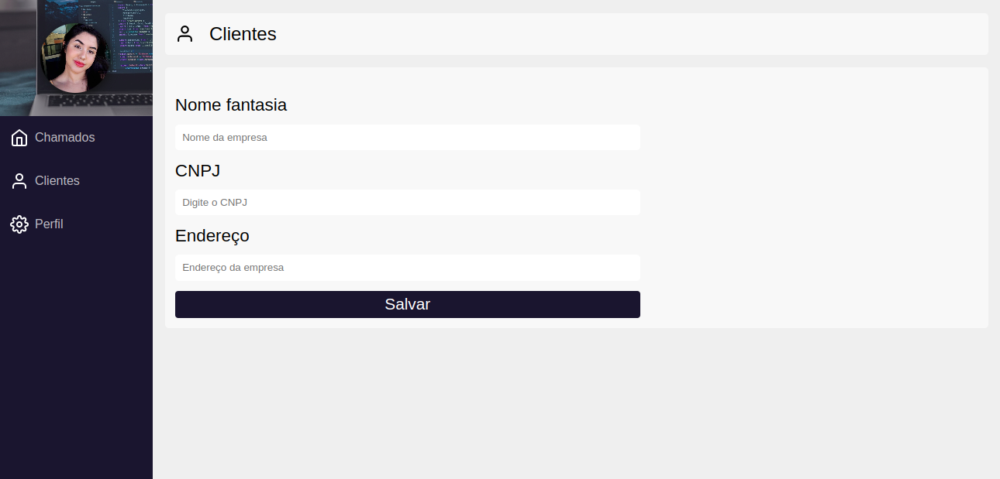
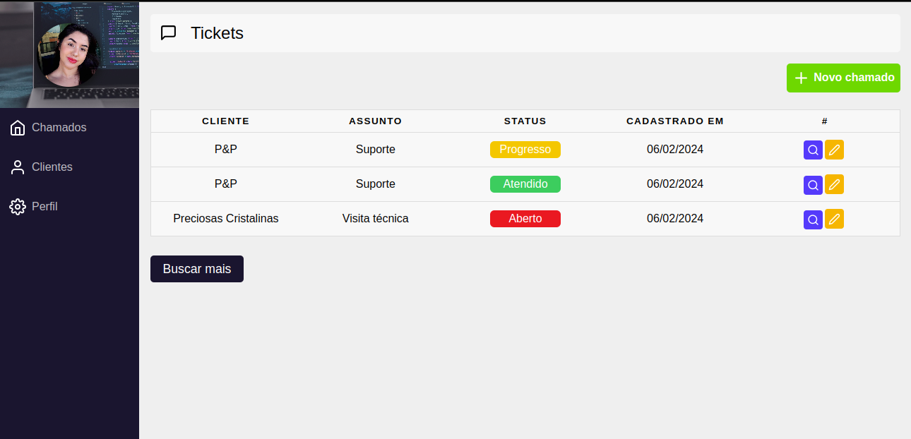
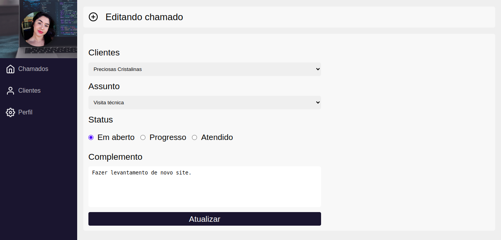
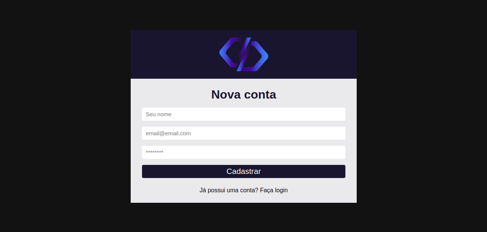

# Sistema de chamados
As features do sistema de chamados consistem em:
* Cadastro de usário.
* Login de usuário.
* Edição de perfil do usuário.
* Cada usuário tem em sua plataforma uma página de cadastro de clientes.
* Cada usuário tem em sua plataforma uma página de chamados.
* Os chamadados podem ser registrados, listados e atualizados.

| Página de login | Perfil do usuário | Cadastro de cliente |
|------------|-------------|-------------|
|  |  |  |

| Lista de chamados | Modal de um chamado | Edição de um chamado |
|------------|-------------|-------------|
|  |  |  |

| Página de cadastro | 
|------------|
|  |