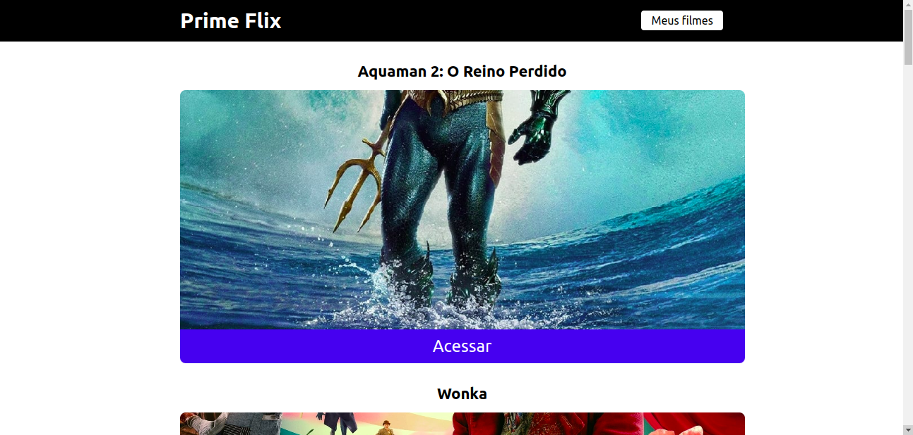
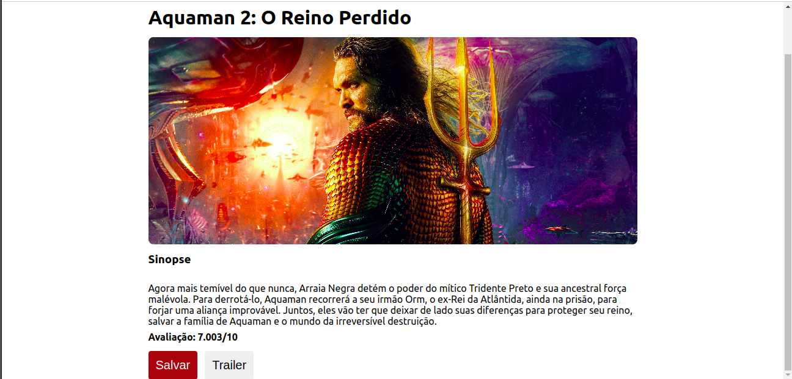
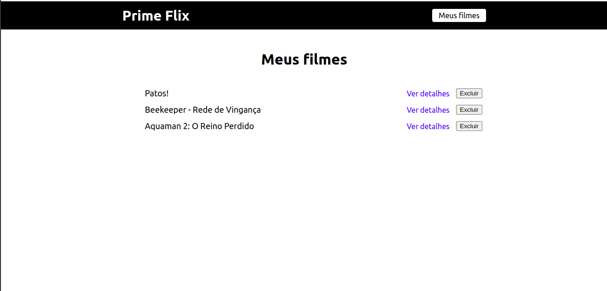

# Prime Flix
Prime Flix é um projeto capaz de salvar filmes em memória local utilizando localStorage do JavaScript, ou seja, ainda que você feche o navegador as informações serão mantidas. Além disso o Prime Flix contém informações de filmes disponibilizados pela API **themoviedb**.

## Listagem de filmes

## Acessar informações do filme

## Salvar filme

## Listar meus filmes

