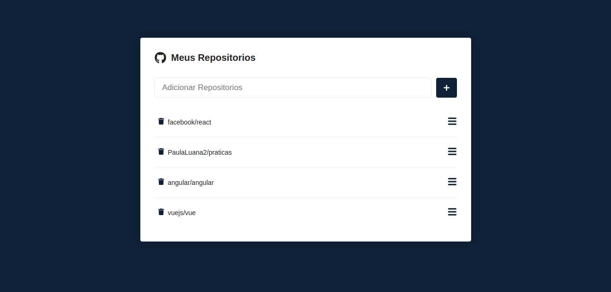
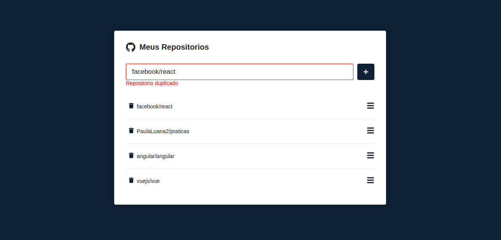
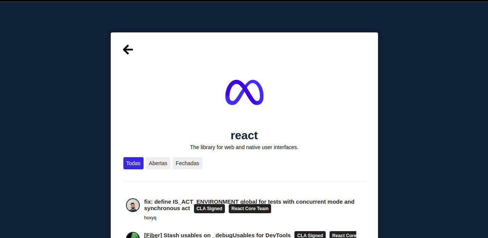
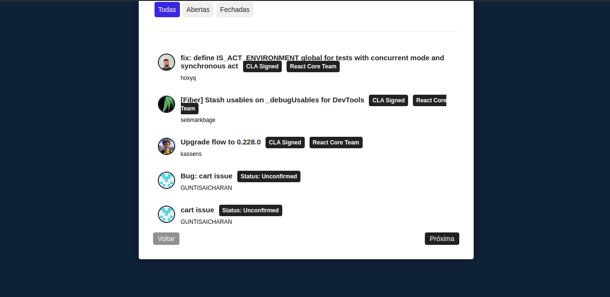
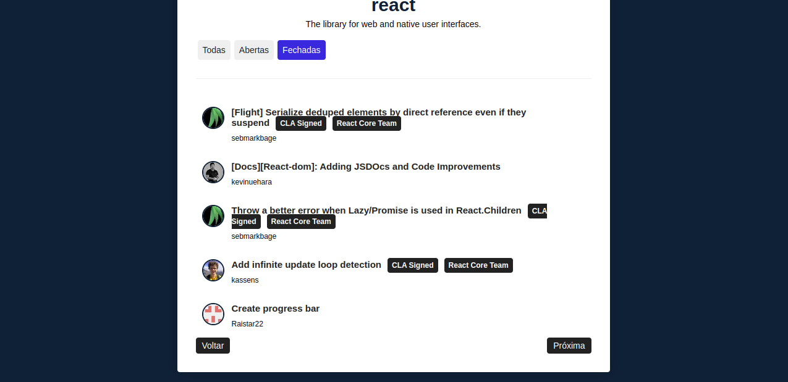

# Aplicação Repos

A aplicação **Repos** faz a utilização da API do GitHub afim de salvar seus repositórios favoritos e poder visualizar suas issues. Assim, quando o nome de um repositório que não existe é informado, consequentemente ele não é adicionado pois não foi encontrado no GitHub.

Coisas interessantes nessa aplicação: 
* O uso da API do GitHub.
* A paginação feita com as issues.
* A mudança das issues por estado.

**Listagem dos seus repositórios favoritos, podendo remover repositório ou listar seus detalhes.**

| Repositório duplicado  | Repositório não encontrado |
|------------|-------------|
|  |  |

**Detalhes do repositório com suas *issues* listadas, podendo ser filtradas como abertas, fechadas e todas.**

